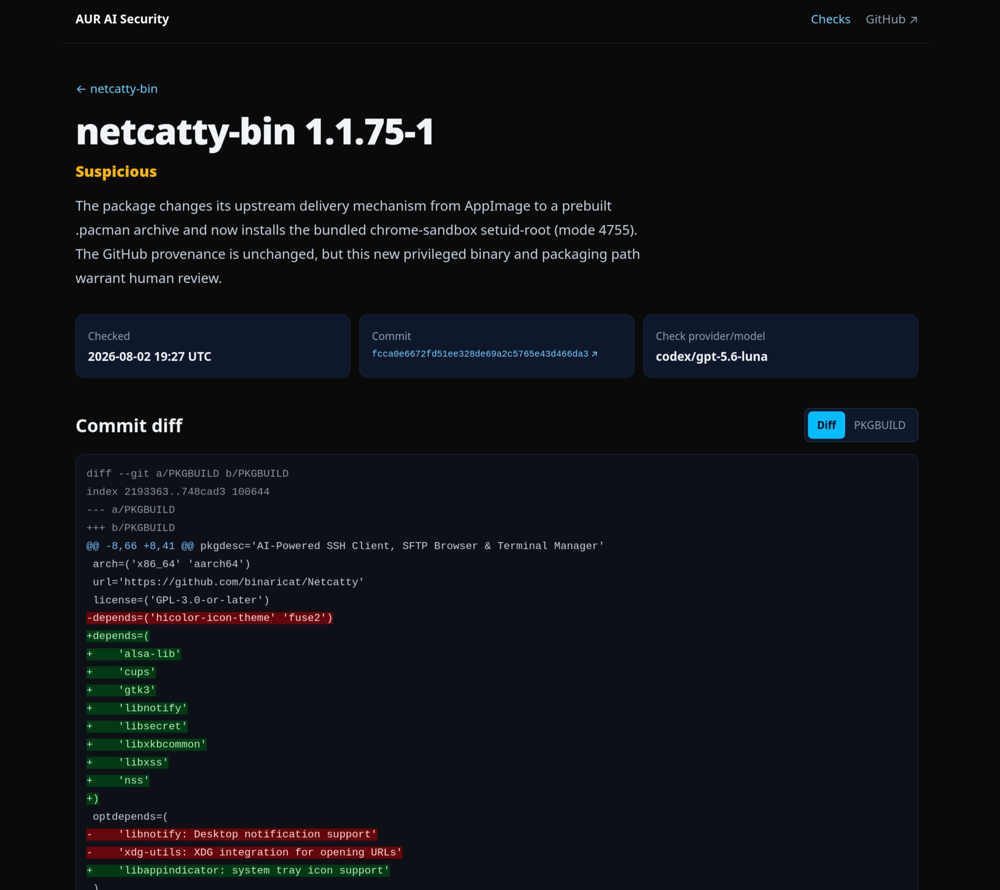
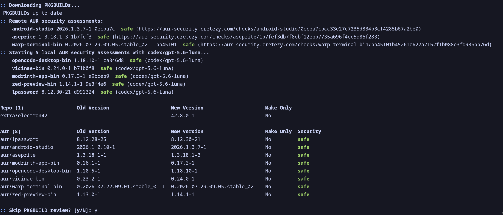

# AUR AI Security

[AUR AI Security](https://github.com/Cretezy/aur_ai_security) is an AI-assisted review pipeline for the [Arch User Repository](https://aur.archlinux.org/). It indexes package versions, examines AUR Git repositories for malware and supply-chain risk, and presents the evidence in a searchable web interface.

[Read the article](https://cretezy.com/2026/aur-ai-security/) · [Try the live demo](https://aur-security.cretezy.com/)

Every assessment preserves the exact Git commit, complete `PKGBUILD`, and commit diff so that its verdict can be reviewed rather than treated as a black box.

## Motivation

An AUR `PKGBUILD` or install script is code that runs while software is built and installed. During the June 2026 [active AUR malicious-packages incident](https://archlinux.org/news/active-aur-malicious-packages-incident/), Arch removed malicious commits and urged users to review every PKGBUILD and install-script change. A [second wave reported in July](https://www.phoronix.com/news/Arch-Linux-AUR-Adoptions-Halted) led Arch to temporarily halt package adoptions.

A familiar or orphaned package can receive a malicious update through the same workflow as an ordinary version bump. Manual review does not scale, but an unexplained “AI says safe” result is not a useful substitute. This project surfaces unusual changes while retaining enough evidence for a person to verify each result.

## How it works

1. `update-index` downloads current AUR metadata and appends newly seen package versions to SQLite.
2. `check` selects current, unchecked versions, clones each package-base repository, and records its commit, `PKGBUILD`, and diff.
3. OpenAI, Anthropic, OpenRouter, or the Codex CLI reviews the package in repository context.
4. The verdict and supporting evidence are stored separately from package metadata and exposed through the web interface and API.

## Demo

[](https://aur-security.cretezy.com/)

Click the screenshot to open the [live demo](https://aur-security.cretezy.com/).

## `paru` integration

The experimental [`aur-ai-security` branch](https://github.com/Cretezy/paru/tree/aur-ai-security) checks the hosted API first, then locally assesses packages without a remote result using your configured provider and model. It runs after downloading AUR repositories and before executing pre-build commands or starting the build.

These `paru.conf` options enable remote lookups with a local Codex fallback:

```ini
[options]
AurSecurityRemote
# AurSecurityRemoteUrl = https://aur-security.cretezy.com
AurSecurityProvider = codex
AurSecurityModel = gpt-5.6-luna
# SkipSafeReviews
# SkipAurSecurity
```

`AurSecurityRemoteUrl` is optional and defaults to the hosted service. Omit `AurSecurityRemote` to use local assessment only. `AurSecurityProvider` accepts `openai`, `anthropic`, `openrouter`, or `codex`; `AurSecurityModel` is the corresponding model identifier described in [AI providers](#ai-providers). API providers require their matching environment variable, while `codex` requires an installed and authenticated Codex CLI.

Assessments are printed before the transaction table, whose verbose form includes a security-status column. Before review, `paru` asks whether safely assessed packages should be skipped; `SkipSafeReviews` makes skipping them the default answer. Suspicious, dangerous, unreviewed, and failed assessments remain in the normal review flow. With `--noconfirm`, a dangerous verdict aborts the transaction. `SkipAurSecurity` or `--skipaursecurity` disables the integration.



## Review philosophy

Checks return one of three verdicts:

- `safe` for ordinary packaging behavior
- `suspicious` when a concrete concern needs human review
- `dangerous` when there is strong evidence of malicious behavior

The prompt accounts for provenance. A version and checksum bump from the same upstream source is usually normal; a changed domain, repository owner, or download mechanism warrants more scrutiny, as do obfuscated commands, credential access, persistence, and privilege escalation.

This is a review aid, not proof that a package is safe. It does not analyze downloaded binaries and can produce false positives or miss malicious behavior. Inspect suspicious changes, repository history, and upstream provenance before installing an AUR package.

## Quick start

You need Rust, Cargo, Git access to `aur.archlinux.org`, and either API credentials or an installed and authenticated Codex CLI.

Download the current AUR index:

```bash
cargo run -p aur_ai_security -- update-index
```

Preview packages modified during the last day without cloning repositories or calling a provider:

```bash
cargo run -p aur_ai_security -- check --dry-run \
  --provider openai \
  --model gpt-5.6-luna \
  --since 24h
```

Run checks with OpenAI:

```bash
export OPENAI_API_KEY="your-api-key"

cargo run -p aur_ai_security -- check \
  --provider openai \
  --model gpt-5.6-luna \
  --filter 010editor spotify
```

The default database is `sqlite.db`. Override it with the global option:

```bash
cargo run -p aur_ai_security -- --database data/aur-ai-security.sqlite update-index
```

For release binaries, run `cargo build --release`. This produces `target/release/aur_ai_security` and `target/release/aur_ai_security_web`.

## CLI

### `update-index`

`update-index` downloads `packages-meta-v1.json.gz` and records the current version of every AUR package. New versions are appended; older versions remain as history but are marked non-current. Seeing the same package and version again refreshes its metadata.

Stored metadata includes package and package-base identifiers, version, submitter, last-modified time, popularity, snapshot path, and first-seen, last-seen, and current-version state.

### `check`

`check` reviews current package versions that have not already been checked with the selected provider and model:

```bash
cargo run -p aur_ai_security -- check --provider <PROVIDER> --model <MODEL> [OPTIONS]
```

Supported providers are `openai`, `anthropic`, `openrouter`, and `codex`. Useful filters include:

```bash
# Exact package names
--filter 010editor spotify visual-studio-code-bin

# Relative time
--since 30m
--since 12h
--since 7d

# Unix timestamp, relative seconds, RFC 3339, or date
--since 1773703418
--since -30
--since 2026-03-17T12:00:00Z
--since 2026-03-17
```

`--since` uses the package's AUR `LastModified` timestamp and composes with `--filter` and `--dry-run`. Timestamps without an explicit timezone are interpreted as UTC.

## AI providers

| Provider | Authentication | Model argument |
| --- | --- | --- |
| OpenAI | `OPENAI_API_KEY` | OpenAI model name |
| Anthropic | `ANTHROPIC_API_KEY` | Anthropic model name |
| OpenRouter | `OPENROUTER_API_KEY` | Usually `provider/model` |
| Codex CLI | Installed and authenticated Codex CLI | Codex model name |

The API providers use [Rig](https://github.com/0xPlaygrounds/rig). Their only repository tool, `read_file`, can inspect UTF-8 text files up to 128 KiB inside the clone; absolute paths, parent traversal, and symlinks resolving outside the clone are rejected. Structured-output support through OpenRouter depends on the upstream model.

The Codex provider runs `codex exec` from the clone in an ephemeral session. It ignores user configuration, disables shell tools and web search, and supplies the assessment JSON schema.

## Results and storage

Each successful check stores the verdict and explanation, provider and model, checked Git commit, complete `PKGBUILD`, diff from the commit's first parent, and check timestamp. Checks are unique per package version, provider, and model.

The shared database crate runs migrations automatically when either application starts. Its main tables are:

- `package_versions`: historical AUR metadata keyed by package name and version
- `checks`: AI assessments linked to package-version rows

After changing the schema during development, delete the local database and run `update-index` to create a fresh one.

## Web interface

The [Topcoat](https://github.com/tokio-rs/topcoat) web application reads the same SQLite database as the CLI. Install the development CLI and start it from the workspace root:

```bash
cargo install topcoat-cli
topcoat dev --package aur_ai_security_web
```

It listens on `http://127.0.0.1:3000` by default. Use `HOST`, `PORT`, and `AUR_AI_SECURITY_DATABASE` to customize the server. The interface provides package search, verdict filters, check history, complete PKGBUILDs, and highlighted diffs.

The JSON API includes `POST /api/v1/checks/lookup` for batch assessment lookup by package base and commit.

For production, bundle the generated assets before starting the server:

```bash
cargo build --release -p aur_ai_security_web
topcoat asset bundle --release --package aur_ai_security_web
./target/release/aur_ai_security_web --database sqlite.db
```

## Workspace

- `checker` (`aur_ai_security_checker`): repository cloning, evidence collection, and AI assessment
- `db` (`aur_ai_security_db`): SQLite connection, migrations, and queries
- `cli` (`aur_ai_security`): indexing, candidate selection, and result persistence
- `web` (`aur_ai_security_web`): package search and assessment browsing

The CLI and web application share the database crate; the checker is independent of clap, SQLx, and the index database.

## Development

```bash
cargo test --workspace --locked
cargo clippy --workspace --locked --all-targets -- -D warnings
cargo fmt --all
```

Logging defaults to `INFO`. Use `RUST_LOG=debug` or a crate-specific filter such as `RUST_LOG=aur_ai_security_checker=debug,aur_ai_security=info`. SQLx remains at `INFO` and Rig at `WARN` under the broad debug filter; opt in with `sqlx=debug` or `rig_core=debug` when needed. Prompts and file contents are not logged.

## License

Licensed under the [GNU General Public License v3.0](LICENSE).
